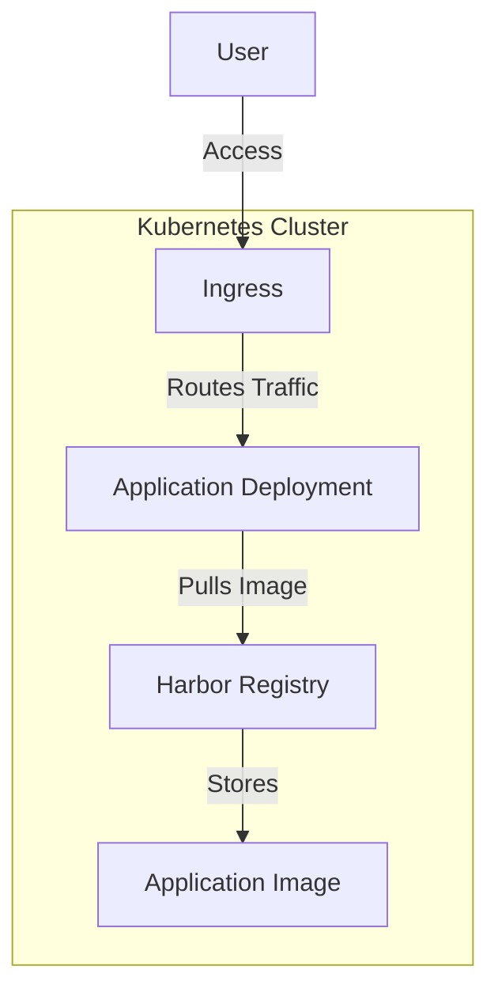

# Terraform Kubernetes Harbor and Application Deployment

This repository contains Terraform configurations to deploy [Harbor](https://goharbor.io/) (a CNCF-certified registry) and a sample application on a Kubernetes cluster. The infrastructure is designed for non-commercial use under the **Non-Commercial Source License (NCSL v1.0)**.

## Overview

### Components
1. **Harbor Registry**: 
   - Deployed via Helm with customizable storage classes.
   - Configured with TLS, ingress, and persistent storage.
   - Includes admin credentials management.

2. **Sample Application**:
   - Deployed as a Kubernetes `Deployment` with a `LoadBalancer` service.
   - Pulls container images from the deployed Harbor registry.
   - Exposed via an NGINX ingress controller.

### Architecture


## Prerequisites

1. **Kubernetes Cluster** with:
   - LoadBalancer support (e.g., MetalLB, cloud provider LB).
   - Default StorageClass or custom StorageClass (configured in `variables.tf`).
   - NGINX Ingress Controller installed.

2. **Tools**:
   - Terraform ≥1.2
   - `kubectl` configured with cluster access (update `providers.tf` with your `kubeconfig` path)
   - Helm ≥3.0

## Getting Started

### 1. Clone Repository
```bash
git clone https://github.com/your-org/terraform-harbor-app.git
cd terraform-harbor-app
```

### 2. Configure Variables
Create `terraform.tfvars` with your values:
```hcl
namespace             = "your-namespace"
harbor_password       = "secure-admin-password"
robot_token           = "harbor-robot-account-token"
storage_class         = "your-storage-class"
harbor_url            = "harbor.your-domain.com"
domain                = "app.your-domain.com"
```

### 3. Initialize Terraform
```bash
terraform init
```

### 4. Deploy Infrastructure
```bash
terraform apply
```

## Configuration

### Key Variables (see [`variables.tf`](./variables.tf))
| Variable | Description | Default |
|----------|-------------|---------|
| `namespace` | Target Kubernetes namespace | `diego-navarro` |
| `storage_class` | StorageClass for PVCs | `kadalu.external-gluster-nfs-test` |
| `harbor_url` | Harbor registry URL | `harbor.blautech.diegonavarro.dev` |
| `domain` | Base domain for ingress | `harbor.blautech.diegonavarro.dev` |
| `harbor_password` | Harbor admin password | *Required* |
| `robot_token` | Harbor robot account token | *Required* |

### Modules
- **Harbor** ([`modules/harbor`](./modules/harbor)):  
  Deploys Harbor with Helm, configures persistent storage, and exposes via LoadBalancer.
- **App** ([`modules/app`](./modules/app)):  
  Deploys a sample application with ingress, using images from Harbor.

## Accessing Services

### Harbor Registry
- **URL**: `https://${var.harbor_url}`  
- **Credentials**:  
  Username: `admin`  
  Password: Value of `harbor_admin_password` variable

### Sample Application
- **URL**: `https://${var.domain}` (configured in ingress)

## Troubleshooting

1. **Check Pod Status**:
   ```bash
   kubectl --kubeconfig=~/Downloads/kubeconfig2.yml get pods -n $NAMESPACE
   ```

2. **View Application Logs**:
   ```bash
   kubectl logs -l app=technical-app -n $NAMESPACE
   ```

3. **Verify Ingress Configuration**:
   ```bash
   kubectl get ingress -n $NAMESPACE
   ```

## Cleanup
```bash
terraform destroy
```

## License
This project is licensed under the **Non-Commercial Source License (NCSL v1.0)**. Commercial use is strictly prohibited without explicit permission. See [LICENSE](./LICENSE) for details.

---

**Note**: Update all references to `blautech.diegonavarro.dev` in configuration files to match your domain.
